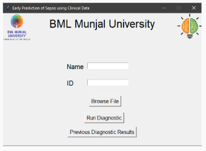
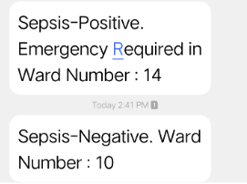

# SepsisDetection
Early Prediction of Sepsis from Clinical Data using LSTM Neural Network.

* Used LSTM neural networks for prediction.
* Look into Analysis folder for images and sepsis.ipynb for notebook file.
* Once the patient is tested positive during the realtime analysis, the doctor gets an alert by sms.
* The current model is not integrated to real time, it takes medical files for testing in format of dataset.
* Our model gave an accuracy of 95%, you can see the analysis and model in sepsis.ipynb

Dataset Link: <https://physionet.org/content/challenge-2019/1.0.0/>

#### Interface View:

#### Sms Result when patient tested positive:

### Future scope

* Integrate with realtime data.
* Show the vitals analysis of each patient through an app to doctors.
* Spreading awareness to the community through app.

Note: This is the prototype we have made in the SIH 2020. 
